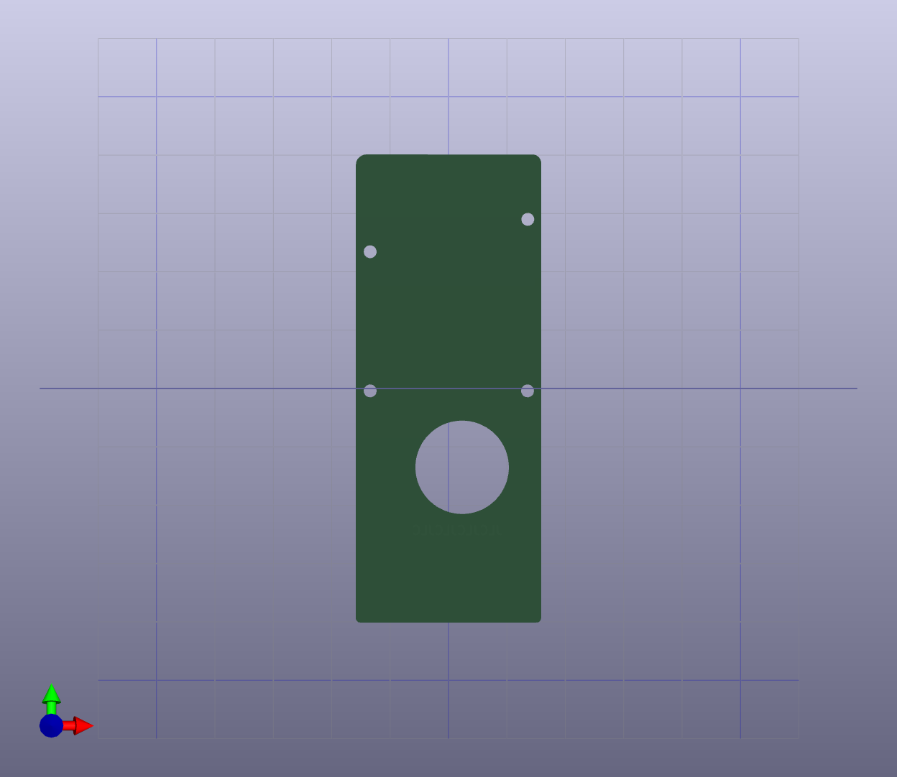
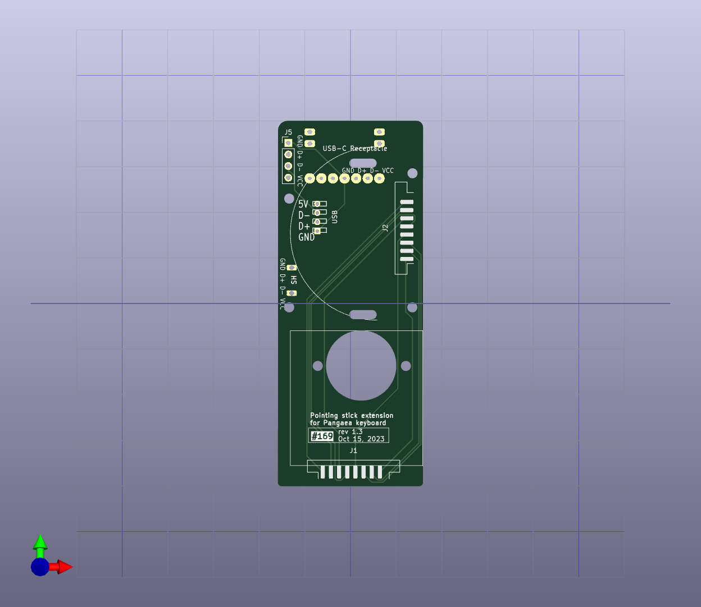

# Pointing stick extension for Pangaea keyboard

This pointing stick extenson is for Pangaea keyboard RI 1.2. It allows to use pointing stick module without wiring the modules.
Needs to replace with the original Pro Micro cover with this extension.

## history
2023/05/27 Orderd rev1.3 and wait for the PCB.

2023/10/15 Updated PCB design, not tested yet.

2023/11/5  Added pitctures.
